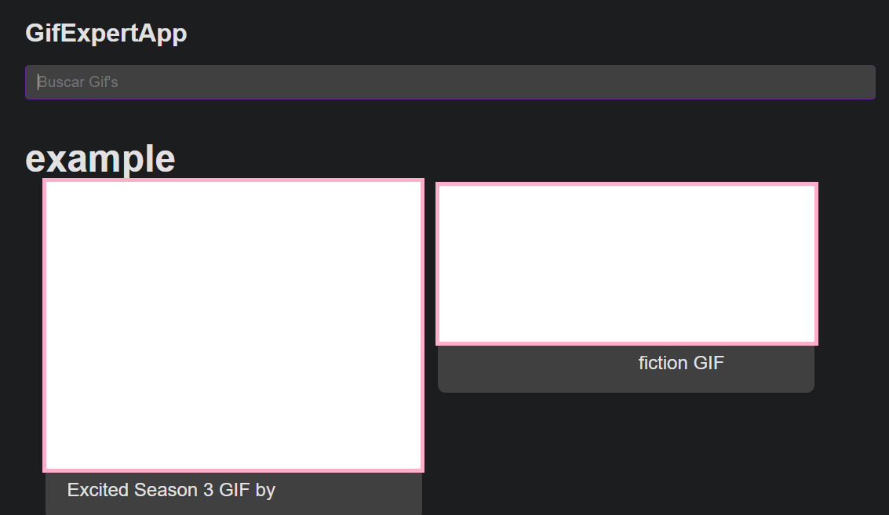

## GifExpert

Este es un proyecto de practica en React con Vite, utilizando la API de Giphy para obtener Gif's.

### Instalar dependencias.

> **_NOTA:_**
> Preferentemente utilizar Yarn

```
yarn install
ó
npm install
```

### Estilos CSS

Los colores del proyecto pueden variar dependiendo del tema de su equipo( Claro / Oscuro).

### Variables de entorno.

El proyecto hace uso del servicio de Giphy para funcionar, por lo que es necesario **crear un archivo en la raíz del proyecto** llamado **".env"**, dentro de ese archivo, se añadirán las debidas variables de entorno, las cuales se encuentran en el archivo **".env.template"**, estas **deben ser reemplazadas** por **sus propias credenciales** para el funcionamiento del proyecto.

El archivo encargado de este proceso se encuentra en: **"src/helpers/getEnv.js"**.

### Iniciar la app.

Para ejecutar el proyecto, simplemente ejecuten:

```
yarn dev
ó
npm run dev
```

### Vista previa

> Por motivos de copyright no se muestran capturas de los gif's


